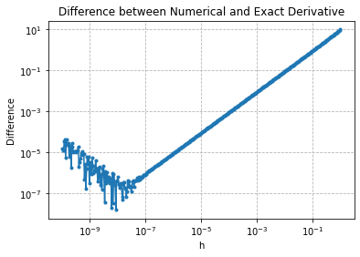
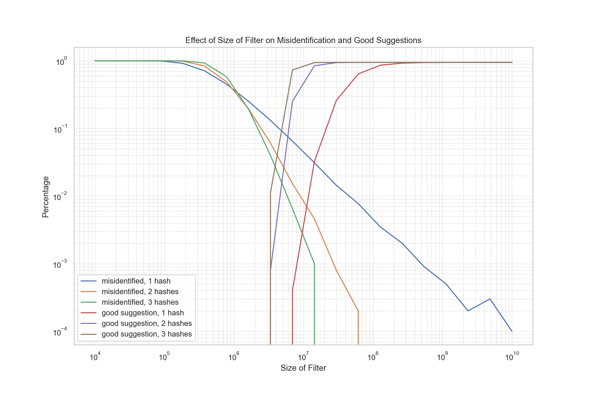
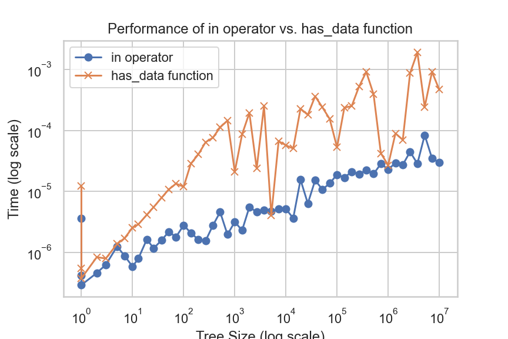
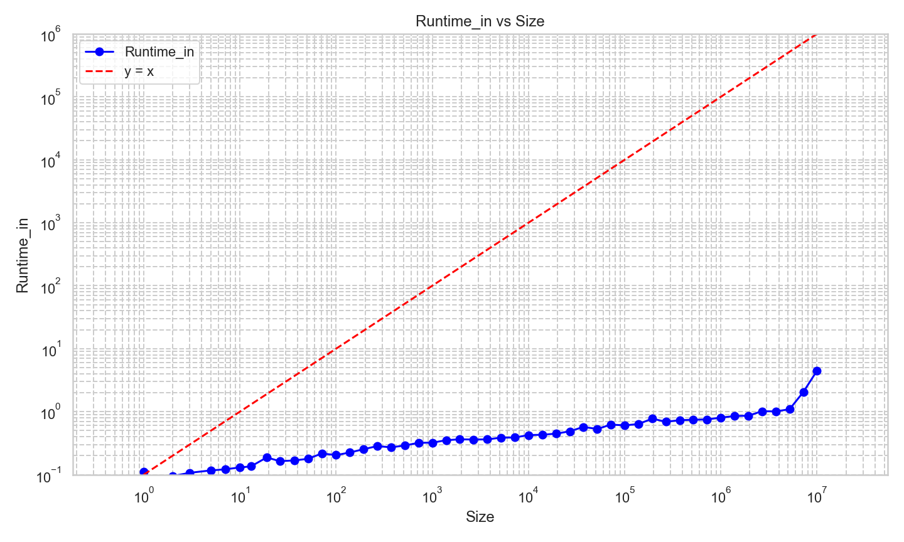
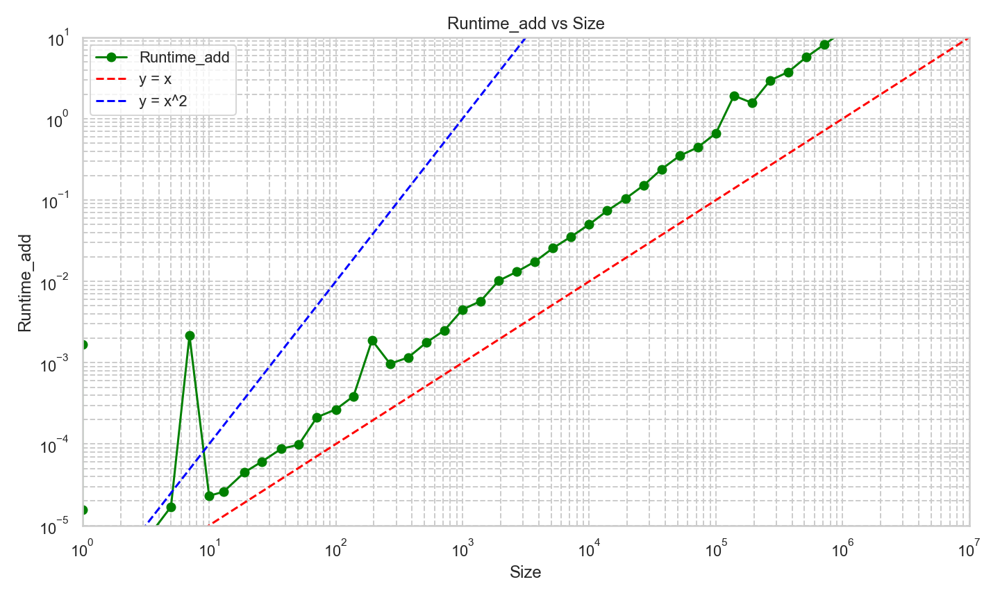

# Exercise 1

## Plotting Numerical Derivative Differences on a Log-Log Graph

To understand how the numerical approximation of a derivative compares to the exact derivative, we're going to evaluate the function \(f(x) = x^3\) and its derivative at \(x = 3\).

### Steps:

1. **Compute the Exact Derivative**:
   The analytical derivative of \(f(x) = x^3\) is \(f'(x) = 3x^2\). Evaluating at \(x = 3\), we get \(f'(3) = 27\).

2. **Compute the Numerical Derivative**:
   For a range of \(h\) values between \(10^{-10}\) and \(1\), compute the difference between the numerical derivative \(\frac{f(3+h) - f(3)}{h}\) and the exact derivative \(f'(3)\).

3. **Plot the Difference**:
   We'll plot the absolute value of the difference (from step 2) against the \(h\) values on a log-log graph.


```python
import numpy as np
import matplotlib.pyplot as plt

# Define the function
def f(x):
    return x**3

# Compute the derivative of f at x = 3
f_prime_3 = 3 * (3**2)

# Generate h values
h_values = np.logspace(-10, 0, 400)

# Compute the difference for each h
differences = [np.abs((f(3+h) - f(3))/h - f_prime_3) for h in h_values]

# Plot on a log-log graph
plt.loglog(h_values, differences, '-o', markersize=3)
plt.xlabel('h')
plt.ylabel('Difference')
plt.title('Difference between Numerical and Exact Derivative')
plt.grid(True, which="both", ls="--", c='0.7')
plt.show()
```


    

    


## Observations as \( h \) gets smaller

As \( h \) decreases, the absolute difference between the numerical and actual derivative initially decreases, reflecting the improving accuracy of the numerical derivative. This is expected since the definition of a derivative is a limit as \( h \) approaches zero.

However, for very small values of \( h \), the absolute difference starts to increase. This means the numerical derivative becomes less accurate when \( h \) is too close to zero.

## Hypothesis

The observed inaccuracy for extremely small \( h \) can be attributed to the limitations of floating-point arithmetic in computers. As \( h \) gets exceedingly small, the calculations involving \( h \) become prone to numerical errors due to the finite precision with which computers represent real numbers.

For instance, when subtracting two nearly equal numbers, significant digits can be lost, leading to a loss of precision in the result. This phenomenon is known as *catastrophic cancellation*. The smaller the value of \( h \), the more pronounced this effect becomes in the computation of the numerical derivative, leading to the observed increase in the absolute difference.

# Exercise 2

## Implementing a Bloom Filter

A Bloom filter is a space-efficient probabilistic data structure to test whether an element is a member of a set. The chance of false positives can occur, but false negatives do not.

### Objective

We aim to implement a Bloom filter using a `bitarray` and three hash functions: `sha256`, `blake2b`, and `sha3_256` to store English words and identify if a word might be in the dataset.

### Steps
1. **Initialize Bloom Filter:**
    Initialize the Bloom filter as a `bitarray` of zeros of some arbitrary `size`.
2. **Hash Functions:**
    Define the three given hash functions that return integer values within the range `[0, size)`.
3. **Adding Words:**
    For each word in the dataset, compute hash values using the three hash functions and set the corresponding positions in the `bitarray` to 1.
4. **Checking Words:**
    To check if a word is likely in the dataset, compute its hash values using the three hash functions. If any of the corresponding positions in the `bitarray` is 0, the word is definitely not in the dataset. If all are 1, the word might be in the dataset, with a certain probability of being a false positive.


```python
import bitarray
from hashlib import sha3_256, sha256, blake2b

class BloomFilter:
    def __init__(self, size=int(1e7)):  # default size is arbitrary; it could be adjusted
        self.size = size
        self.data = bitarray.bitarray(size)
        self.data.setall(0)

    def add(self, s):
        self.data[self.my_hash(s)] = 1
        self.data[self.my_hash2(s)] = 1
        self.data[self.my_hash3(s)] = 1

    def check(self, s):
        return self.data[self.my_hash(s)] and self.data[self.my_hash2(s)] and self.data[self.my_hash3(s)]

    def my_hash(self, s):
        return int(sha256(s.lower().encode()).hexdigest(), 16) % self.size

    def my_hash2(self, s):
        return int(blake2b(s.lower().encode()).hexdigest(), 16) % self.size

    def my_hash3(self, s):
        return int(sha3_256(s.lower().encode()).hexdigest(), 16) % self.size
```


```python
# Initialize bloom filter
bloom = BloomFilter()
```


```python
# Add words to bloom filter
with open('words.txt') as f:
    for line in f:
        word = line.strip()
        bloom.add(word)
```


```python
# Test with some words
test_word = "floeer"
if bloom.check(test_word):
    print(f"{test_word} might be in the dataset")
else:
    print(f"{test_word} is definitely not in the dataset")
```

    floeer is definitely not in the dataset


## Implementing Spelling Correction with Bloom Filter


```python
import bitarray
from hashlib import sha3_256, sha256, blake2b

# Define the size of your bloom filter
size = 10000000
data1 = bitarray.bitarray(size)
data2 = bitarray.bitarray(size)
data3 = bitarray.bitarray(size)

data1.setall(0)
data2.setall(0)
data3.setall(0)

# Define the hash functions
def my_hash(s):
    return int(sha256(s.lower().encode()).hexdigest(), 16) % size

def my_hash2(s):
    return int(blake2b(s.lower().encode()).hexdigest(), 16) % size

def my_hash3(s):
    return int(sha3_256(s.lower().encode()).hexdigest(), 16) % size

with open('words.txt') as f:
    for line in f:
        word = line.strip()
        data1[my_hash(word)] = 1
        data2[my_hash(word)] = 1
        data2[my_hash2(word)] = 1
        data3[my_hash(word)] = 1
        data3[my_hash2(word)] = 1
        data3[my_hash3(word)] = 1


# Define the spelling correction functions
import string
def spelling_correction1(word):  # Using the first two hash functions
    possible_suggestions = []
    alphabet = list(string.ascii_lowercase)
    for i in range(len(word)):
        for letter in alphabet:
            new_word = word[:i] + letter + word[i+1:]
            if data1[my_hash(new_word)]:
                possible_suggestions.append(new_word)
    return possible_suggestions

def spelling_correction2(word):  # Using the first two hash functions
    possible_suggestions = []
    alphabet = list(string.ascii_lowercase)
    for i in range(len(word)):
        for letter in alphabet:
            new_word = word[:i] + letter + word[i+1:]
            if data2[my_hash(new_word)] and data2[my_hash2(new_word)]:
                possible_suggestions.append(new_word)
    return possible_suggestions

def spelling_correction3(word):  # Using all three hash functions
    possible_suggestions = []
    alphabet = list(string.ascii_lowercase)
    for i in range(len(word)):
        for letter in alphabet:
            new_word = word[:i] + letter + word[i+1:]
            if data3[my_hash(new_word)] and data3[my_hash2(new_word)] and data3[my_hash3(new_word)]:
                possible_suggestions.append(new_word)
    return possible_suggestions
```

### Spelling corrections of “floeer” when using 1e7 bits: 


```python
print(spelling_correction1("floeer"))
```

    ['bloeer', 'qloeer', 'fyoeer', 'flofer', 'floter', 'flower', 'floeqr', 'floees']


```python
print(spelling_correction2("floeer"))
```

    ['fyoeer', 'floter', 'flower']


```python
print(spelling_correction3("floeer"))
```

    ['floter', 'flower']


# Evaluate the Effectiveness for Different Sizes and Hash Functions

In this analysis, we use a Bloom filter to suggest spelling corrections. We analyze the performance of our Bloom filter implementation by varying the filter size and the number of hash functions used. Our primary metrics for performance are the number of misidentified words and the number of "good suggestions".


```python
import json
import pandas as pd
import numpy as np
```

    /Users/jiangbei/opt/anaconda3/lib/python3.8/site-packages/pandas/core/computation/expressions.py:20: UserWarning: Pandas requires version '2.7.3' or newer of 'numexpr' (version '2.7.1' currently installed).
      from pandas.core.computation.check import NUMEXPR_INSTALLED


```python
# Load typos
with open('typos.json', 'r') as file:
    typos = json.load(file)
```


```python
# Initialize arrays for storing results
test_size = np.logspace(4, 10, num=20, dtype=int, base=10)
num_misidentified1 = []
num_good_suggestions1 = []
num_misidentified2 = []
num_good_suggestions2 = []
num_misidentified3 = []
num_good_suggestions3 = []
```


```python
# Test loop for different sizes
count = 0
for size in test_size: 
    count += 1
    print(count)
    # Initialize bloom filters for each hash function combination
    data1 = bitarray.bitarray(size)  # Using the first hash function
    data2 = bitarray.bitarray(size)  # Using the first two hash functions
    data3 = bitarray.bitarray(size)  # Using all three hash functions
    data1.setall(0)
    data2.setall(0)
    data3.setall(0)
    
     # Define hash functions 
    def my_hash(s):
        return int(sha256(s.lower().encode()).hexdigest(), 16) % size

    def my_hash2(s):
        return int(blake2b(s.lower().encode()).hexdigest(), 16) % size

    def my_hash3(s):
        return int(sha3_256(s.lower().encode()).hexdigest(), 16) % size

    # Populate bloom filters using words from file
    with open('words.txt') as f:
        for line in f:
            word = line.strip()
            data1[my_hash(word)] = 1
            data2[my_hash(word)] = 1
            data2[my_hash2(word)] = 1
            data3[my_hash(word)] = 1
            data3[my_hash2(word)] = 1
            data3[my_hash3(word)] = 1
    def spelling_correction1(word):  # Using the first two hash functions
        possible_suggestions = []
        alphabet = list(string.ascii_lowercase)
        for i in range(len(word)):
            for letter in alphabet:
                new_word = word[:i] + letter + word[i+1:]
                if data1[my_hash(new_word)]:
                    possible_suggestions.append(new_word)
        return possible_suggestions

    def spelling_correction2(word):  # Using the first two hash functions
        possible_suggestions = []
        alphabet = list(string.ascii_lowercase)
        for i in range(len(word)):
            for letter in alphabet:
                new_word = word[:i] + letter + word[i+1:]
                if data2[my_hash(new_word)] and data2[my_hash2(new_word)]:
                    possible_suggestions.append(new_word)
        return possible_suggestions

    def spelling_correction3(word):  # Using all three hash functions
        possible_suggestions = []
        alphabet = list(string.ascii_lowercase)
        for i in range(len(word)):
            for letter in alphabet:
                new_word = word[:i] + letter + word[i+1:]
                if data3[my_hash(new_word)] and data3[my_hash2(new_word)] and data3[my_hash3(new_word)]:
                    possible_suggestions.append(new_word)
        return possible_suggestions
    
    # Testing bloom filters with typos dataset
    mis_num1, good_num1, mis_num2, good_num2, mis_num3, good_num3 = 0, 0, 0, 0, 0, 0
    for i in range(len(typos)):
        # For first hash function
        if data1[my_hash(typos[i][0])] == 1:
            mis_num1 += 1
        else:
            correction = spelling_correction1(typos[i][0])
            if typos[i][1] in correction and len(correction) <= 3:
                good_num1 += 1

        # For first two hash functions
        if data2[my_hash(typos[i][0])] == data2[my_hash2(typos[i][0])] == 1:
            mis_num2 += 1
        else:
            correction = spelling_correction2(typos[i][0])
            if typos[i][1] in correction and len(correction) <= 3:
                good_num2 += 1

        # For all three hash functions
        if data3[my_hash(typos[i][0])] == data3[my_hash2(typos[i][0])] == data3[my_hash3(typos[i][0])] == 1:
            mis_num3 += 1
        else:
            correction = spelling_correction3(typos[i][0])
            if typos[i][1] in correction and len(correction) <= 3:
                good_num3 += 1

    # Storing results for this size
    num_misidentified1.append(mis_num1 - len(typos) / 2)
    num_good_suggestions1.append(good_num1)
    num_misidentified2.append(mis_num2 - len(typos) / 2)
    num_good_suggestions2.append(good_num2)
    num_misidentified3.append(mis_num3 - len(typos) / 2)
    num_good_suggestions3.append(good_num3)
```

    1
    2
    3
    4
    5
    6
    7
    8
    9
    10
    11
    12
    13
    14
    15
    16
    17
    18
    19
    20


```python
# Define the categories
categories = [
    "misidentified, 1 hash",
    "misidentified, 2 hashes",
    "misidentified, 3 hashes",
    "good suggestion, 1 hash",
    "good suggestion, 2 hashes",
    "good suggestion, 3 hashes"
]

# Create the main DataFrame
plot_data = pd.DataFrame({
    "size": list(test_size) * 6,
    "percentages": ["{:.2%}".format(num / len(typos) * 2) for num in num_misidentified1 + num_misidentified2 + num_misidentified3 +
                   num_good_suggestions1 + num_good_suggestions2 + num_good_suggestions3],
    "Good suggestions or misclassified": ["misidentified, 1 hash"] * len(test_size) + ["misidentified, 2 hashes"] * len(test_size) +
                                        ["misidentified, 3 hashes"] * len(test_size) + ["good suggestion, 1 hash"] * len(test_size) +
                                        ["good suggestion, 2 hashes"] * len(test_size) + ["good suggestion, 3 hashes"] * len(test_size)
})

# Split the main DataFrame into 6 separate DataFrames
dfs = {}
for category in categories:
    dfs[category] = plot_data[plot_data['Good suggestions or misclassified'] == category]

# Print each DataFrame
for key, df in dfs.items():
    with pd.option_context('display.max_rows', None, 'display.max_columns', None):
        print(f"\nDataFrame for {key}:\n")
        print(df)

```

    
    DataFrame for misidentified, 1 hash:
    
               size percentages Good suggestions or misclassified
    0         10000     100.00%             misidentified, 1 hash
    1         20691     100.00%             misidentified, 1 hash
    2         42813     100.00%             misidentified, 1 hash
    3         88586      99.47%             misidentified, 1 hash
    4        183298      91.85%             misidentified, 1 hash
    5        379269      70.99%             misidentified, 1 hash
    6        784759      45.09%             misidentified, 1 hash
    7       1623776      25.16%             misidentified, 1 hash
    8       3359818      13.16%             misidentified, 1 hash
    9       6951927       6.49%             misidentified, 1 hash
    10     14384498       3.11%             misidentified, 1 hash
    11     29763514       1.44%             misidentified, 1 hash
    12     61584821       0.77%             misidentified, 1 hash
    13    127427498       0.35%             misidentified, 1 hash
    14    263665089       0.20%             misidentified, 1 hash
    15    545559478       0.09%             misidentified, 1 hash
    16   1128837891       0.05%             misidentified, 1 hash
    17   2335721469       0.02%             misidentified, 1 hash
    18   4832930238       0.03%             misidentified, 1 hash
    19  10000000000       0.01%             misidentified, 1 hash
    
    DataFrame for misidentified, 2 hashes:
    
               size percentages Good suggestions or misclassified
    20        10000     100.00%           misidentified, 2 hashes
    21        20691     100.00%           misidentified, 2 hashes
    22        42813     100.00%           misidentified, 2 hashes
    23        88586      99.99%           misidentified, 2 hashes
    24       183298      98.70%           misidentified, 2 hashes
    25       379269      83.74%           misidentified, 2 hashes
    26       784759      48.76%           misidentified, 2 hashes
    27      1623776      19.46%           misidentified, 2 hashes
    28      3359818       6.07%           misidentified, 2 hashes
    29      6951927       1.53%           misidentified, 2 hashes
    30     14384498       0.46%           misidentified, 2 hashes
    31     29763514       0.08%           misidentified, 2 hashes
    32     61584821       0.02%           misidentified, 2 hashes
    33    127427498       0.00%           misidentified, 2 hashes
    34    263665089       0.00%           misidentified, 2 hashes
    35    545559478       0.00%           misidentified, 2 hashes
    36   1128837891       0.00%           misidentified, 2 hashes
    37   2335721469       0.00%           misidentified, 2 hashes
    38   4832930238       0.00%           misidentified, 2 hashes
    39  10000000000       0.00%           misidentified, 2 hashes
    
    DataFrame for misidentified, 3 hashes:
    
               size percentages Good suggestions or misclassified
    40        10000     100.00%           misidentified, 3 hashes
    41        20691     100.00%           misidentified, 3 hashes
    42        42813     100.00%           misidentified, 3 hashes
    43        88586     100.00%           misidentified, 3 hashes
    44       183298      99.87%           misidentified, 3 hashes
    45       379269      92.75%           misidentified, 3 hashes
    46       784759      58.12%           misidentified, 3 hashes
    47      1623776      19.26%           misidentified, 3 hashes
    48      3359818       3.99%           misidentified, 3 hashes
    49      6951927       0.65%           misidentified, 3 hashes
    50     14384498       0.10%           misidentified, 3 hashes
    51     29763514       0.00%           misidentified, 3 hashes
    52     61584821       0.00%           misidentified, 3 hashes
    53    127427498       0.00%           misidentified, 3 hashes
    54    263665089       0.00%           misidentified, 3 hashes
    55    545559478       0.00%           misidentified, 3 hashes
    56   1128837891       0.00%           misidentified, 3 hashes
    57   2335721469       0.00%           misidentified, 3 hashes
    58   4832930238       0.00%           misidentified, 3 hashes
    59  10000000000       0.00%           misidentified, 3 hashes
    
    DataFrame for good suggestion, 1 hash:
    
               size percentages Good suggestions or misclassified
    60        10000       0.00%           good suggestion, 1 hash
    61        20691       0.00%           good suggestion, 1 hash
    62        42813       0.00%           good suggestion, 1 hash
    63        88586       0.00%           good suggestion, 1 hash
    64       183298       0.00%           good suggestion, 1 hash
    65       379269       0.00%           good suggestion, 1 hash
    66       784759       0.00%           good suggestion, 1 hash
    67      1623776       0.00%           good suggestion, 1 hash
    68      3359818       0.00%           good suggestion, 1 hash
    69      6951927       0.04%           good suggestion, 1 hash
    70     14384498       3.24%           good suggestion, 1 hash
    71     29763514      25.95%           good suggestion, 1 hash
    72     61584821      63.89%           good suggestion, 1 hash
    73    127427498      86.01%           good suggestion, 1 hash
    74    263665089      92.50%           good suggestion, 1 hash
    75    545559478      94.15%           good suggestion, 1 hash
    76   1128837891      94.54%           good suggestion, 1 hash
    77   2335721469      94.68%           good suggestion, 1 hash
    78   4832930238      94.72%           good suggestion, 1 hash
    79  10000000000      94.76%           good suggestion, 1 hash
    
    DataFrame for good suggestion, 2 hashes:
    
               size percentages Good suggestions or misclassified
    80        10000       0.00%         good suggestion, 2 hashes
    81        20691       0.00%         good suggestion, 2 hashes
    82        42813       0.00%         good suggestion, 2 hashes
    83        88586       0.00%         good suggestion, 2 hashes
    84       183298       0.00%         good suggestion, 2 hashes
    85       379269       0.00%         good suggestion, 2 hashes
    86       784759       0.00%         good suggestion, 2 hashes
    87      1623776       0.00%         good suggestion, 2 hashes
    88      3359818       0.08%         good suggestion, 2 hashes
    89      6951927      25.17%         good suggestion, 2 hashes
    90     14384498      84.31%         good suggestion, 2 hashes
    91     29763514      94.02%         good suggestion, 2 hashes
    92     61584821      94.65%         good suggestion, 2 hashes
    93    127427498      94.78%         good suggestion, 2 hashes
    94    263665089      94.81%         good suggestion, 2 hashes
    95    545559478      94.81%         good suggestion, 2 hashes
    96   1128837891      94.81%         good suggestion, 2 hashes
    97   2335721469      94.81%         good suggestion, 2 hashes
    98   4832930238      94.81%         good suggestion, 2 hashes
    99  10000000000      94.81%         good suggestion, 2 hashes
    
    DataFrame for good suggestion, 3 hashes:
    
                size percentages Good suggestions or misclassified
    100        10000       0.00%         good suggestion, 3 hashes
    101        20691       0.00%         good suggestion, 3 hashes
    102        42813       0.00%         good suggestion, 3 hashes
    103        88586       0.00%         good suggestion, 3 hashes
    104       183298       0.00%         good suggestion, 3 hashes
    105       379269       0.00%         good suggestion, 3 hashes
    106       784759       0.00%         good suggestion, 3 hashes
    107      1623776       0.00%         good suggestion, 3 hashes
    108      3359818       1.12%         good suggestion, 3 hashes
    109      6951927      73.07%         good suggestion, 3 hashes
    110     14384498      94.16%         good suggestion, 3 hashes
    111     29763514      94.76%         good suggestion, 3 hashes
    112     61584821      94.81%         good suggestion, 3 hashes
    113    127427498      94.81%         good suggestion, 3 hashes
    114    263665089      94.81%         good suggestion, 3 hashes
    115    545559478      94.81%         good suggestion, 3 hashes
    116   1128837891      94.81%         good suggestion, 3 hashes
    117   2335721469      94.81%         good suggestion, 3 hashes
    118   4832930238      94.81%         good suggestion, 3 hashes
    119  10000000000      94.81%         good suggestion, 3 hashes


```python
# Extract sizes and percentages for 'good suggestion, 1 hash'
sizes_1_hash = plot_data.loc[plot_data["Good suggestions or misclassified"] == "good suggestion, 1 hash", "size"].tolist()
percentages_1_hash = [float(p.strip('%')) for p in plot_data.loc[plot_data["Good suggestions or misclassified"] == "good suggestion, 1 hash", "percentages"].tolist()]

# Extract sizes and percentages for 'good suggestion, 2 hashes'
sizes_2_hash = plot_data.loc[plot_data["Good suggestions or misclassified"] == "good suggestion, 2 hashes", "size"].tolist()
percentages_2_hash = [float(p.strip('%')) for p in plot_data.loc[plot_data["Good suggestions or misclassified"] == "good suggestion, 2 hashes", "percentages"].tolist()]

# Extract sizes and percentages for 'good suggestion, 3 hashes'
sizes_3_hash = plot_data.loc[plot_data["Good suggestions or misclassified"] == "good suggestion, 3 hashes", "size"].tolist()
percentages_3_hash = [float(p.strip('%')) for p in plot_data.loc[plot_data["Good suggestions or misclassified"] == "good suggestion, 3 hashes", "percentages"].tolist()]

# Find the size where percentage exceeds 90% for each hash count
size_needed_1_hash = next(size for size, perc in zip(sizes_1_hash, percentages_1_hash) if perc >= 90)
size_needed_2_hash = next(size for size, perc in zip(sizes_2_hash, percentages_2_hash) if perc >= 90)
size_needed_3_hash = next(size for size, perc in zip(sizes_3_hash, percentages_3_hash) if perc >= 90)

size_needed_1_hash, size_needed_2_hash, size_needed_3_hash
```


    (263665089, 29763514, 14384498)


## Conclusion: For the approach to give good suggestions 90% of the time:

- Using 1 hash function, approximately `size_needed_1_hash`:263665089 bits are needed.
- Using 2 hash functions, approximately `size_needed_2_hash`:29763514 bits are needed.
- Using 3 hash functions, approximately `size_needed_3_hash`:14384498 bits are needed.


## Plot Effect of Filter Size & Hash Functions on Misidentifications & Good Suggestions


```python
import pandas as pd
import matplotlib.pyplot as plt

# Convert percentages back to numerical format
plot_data["percentages"] = plot_data["percentages"].str.rstrip('%').astype('float') / 100.0

plt.figure(figsize=(12, 8))

# Loop through the categories and plot the data for each
for category in categories:
    subset = plot_data[plot_data['Good suggestions or misclassified'] == category]
    plt.plot(subset["size"], subset["percentages"], label=category)

plt.xlabel("Size of Filter")
plt.ylabel("Percentage")
plt.title("Effect of Size of Filter on Misidentification and Good Suggestions")
plt.legend()
plt.grid(True, which="both", linestyle="--", linewidth=0.5)
plt.yscale("log")
plt.xscale("log")
plt.show()

```


    

    


# Exercise 3
## Binary Search Tree Implementation


```python
class Tree:
    def __init__(self, value=None, data=None):
        self._value = value
        self._data = data
        self.left = None
        self.right = None

    def add(self, value, data):
        if self._value is None:  # The tree is empty
            self._value = value
            self._data = data
        else:
            if value < self._value:
                if self.left is None:
                    self.left = Tree(value, data)
                else:
                    self.left.add(value, data)
            elif value > self._value:
                if self.right is None:
                    self.right = Tree(value, data)
                else:
                    self.right.add(value, data)
            else:  # value already exists in the tree
                self._data = data  # We can choose to overwrite the data or ignore
```


```python
# Testing the implementation
my_tree = Tree()
for patient_id, initials in [(24601, "JV"), (42, "DA"), (7, "JB"), (143, "FR"), (8675309, "JNY")]:
    my_tree.add(patient_id, initials)
```

## Adding the `__contains__` Method to our Binary Search Tree


```python
def __contains__(self, patient_id):
      if self._value == patient_id:
        return True
      elif self.left and patient_id < self._value:
        return patient_id in self.left
      elif self.right and patient_id > self._value:
        return patient_id in self.right
      else:
        return False
Tree.__contains__ = __contains__
```


```python
# Test cases
print(24601 in my_tree)  # True
print(1492 in my_tree)   # False
```

    True
    False


## `has_data` function for the `Tree` class


```python
# External function to check data
def has_data(tree, target_data):
    if tree is None:
        return False

    if tree._data == target_data:
        return True

    # Check left subtree
    if has_data(tree.left, target_data):
        return True

    # Check right subtree
    return has_data(tree.right, target_data)
```


```python
# Test the has_data function
print(has_data(my_tree, "JV"))   # True
print(has_data(my_tree, "DA"))   # True
print(has_data(my_tree, "ZZ"))   # False
print(has_data(my_tree, "JNY"))  # True
```

    True
    True
    False
    True


## Demonstrating the Performance of `in` operation vs. `has_data` function

### 1. & 2. Generating Trees with Random Data

We'll use Python's `random` module to generate random `patient_ids` and `data`.


```python
import random
import string

def random_string(length=2):
    """Generate a random string of fixed length."""
    letters = string.ascii_uppercase
    return ''.join(random.choice(letters) for _ in range(length))

def generate_random_tree(size):
    """Generate a tree with random patient_ids and data."""
    tree = Tree()
    for _ in range(size):
        patient_id = random.randint(1, 1000000)
        data = random_string()
        tree.add(patient_id, data)
    return tree
```

### 3. Measure Timings

We'll use Python's `timeit` module to measure how long it takes to perform the operations.


```python
import timeit

def measure_time(tree, operation, value):
    start_time = timeit.default_timer()
    operation(tree, value)
    end_time = timeit.default_timer()
    return end_time - start_time
```

### 4. Plotting the Timings


```python
import matplotlib.pyplot as plt
import numpy as np

# Tree sizes to test
#sizes = [10, 100, 1000, 5000, 10000, 50000]
sizes = np.logspace(0,7, num=50, dtype=int, base=10)
# Collect timings
in_timings = []
has_data_timings = []

for size in sizes:
    tree = generate_random_tree(size)
    patient_id = random.randint(1, 1000000)
    data = random_string()

    in_time = measure_time(tree, lambda t, v: v in t, patient_id)
    has_data_time = measure_time(tree, has_data, data)

    in_timings.append(in_time)
    has_data_timings.append(has_data_time)

# Plotting
plt.loglog(sizes, in_timings, marker='o', label="in operator")
plt.loglog(sizes, has_data_timings, marker='x', label="has_data function")
plt.xlabel("Tree Size (log scale)")
plt.ylabel("Time (log scale)")
plt.title("Performance of in operator vs. has_data function")
plt.legend()
plt.show()
```


    

    


--------------------------------------------------------
The second thoughts


```python
class Tree:
    def __init__(self):
        self._value = None
        self.left = None
        self.right = None

    def add(self, item):
        if self._value == None:
            self._value = item
            return True
        elif self._value == item:
            return False
        elif self._value > item:
            if self.left == None:
                self.left = Tree()
            return self.left.add(item)
        elif self._value < item:
            if self.right == None:
                self.right = Tree()
            return self.right.add(item)

    def __contains__(self, item):
        if self._value == item:
            return True
        elif self.left and item < self._value:
            return item in self.left
        elif self.right and item > self._value:
            return item in self.right
        else:
            return False

```


```python
import random
import time
import pandas as pd
import numpy as np
```


```python
runtimes_add = []
runtimes_in = []
sizes = np.logspace(0,7, num=50, dtype=int, base=10)
```


```python
for size in sizes:
    my_tree = Tree()
    start_time = time.perf_counter()
    for item in random.sample(range(1, size*2+1), size):
        my_tree.add(item)
    stop_time = time.perf_counter()
    runtime = stop_time - start_time
    runtimes_add.append(runtime)
    start_time = time.perf_counter()
    for i in range(int(1e5)):
        random.randint(1, size*2) in my_tree
    stop_time = time.perf_counter()
    runtime = stop_time - start_time
    runtimes_in.append(runtime)
```


```python
plot_data = pd.DataFrame(
 {"size": sizes,
 "Runtime_add": runtimes_add,
 "Runtime_in": runtimes_in}
)
plot_data
```


<div>
<style scoped>
    .dataframe tbody tr th:only-of-type {
        vertical-align: middle;
    }

    .dataframe tbody tr th {
        vertical-align: top;
    }

    .dataframe thead th {
        text-align: right;
    }
</style>
<table border="1" class="dataframe">
  <thead>
    <tr style="text-align: right;">
      <th></th>
      <th>size</th>
      <th>Runtime_add</th>
      <th>Runtime_in</th>
    </tr>
  </thead>
  <tbody>
    <tr>
      <th>0</th>
      <td>1</td>
      <td>0.001690</td>
      <td>0.111553</td>
    </tr>
    <tr>
      <th>1</th>
      <td>1</td>
      <td>0.000015</td>
      <td>0.084969</td>
    </tr>
    <tr>
      <th>2</th>
      <td>1</td>
      <td>0.000004</td>
      <td>0.085746</td>
    </tr>
    <tr>
      <th>3</th>
      <td>2</td>
      <td>0.000005</td>
      <td>0.094769</td>
    </tr>
    <tr>
      <th>4</th>
      <td>3</td>
      <td>0.000006</td>
      <td>0.106812</td>
    </tr>
    <tr>
      <th>5</th>
      <td>5</td>
      <td>0.000017</td>
      <td>0.116587</td>
    </tr>
    <tr>
      <th>6</th>
      <td>7</td>
      <td>0.002168</td>
      <td>0.121187</td>
    </tr>
    <tr>
      <th>7</th>
      <td>10</td>
      <td>0.000023</td>
      <td>0.129916</td>
    </tr>
    <tr>
      <th>8</th>
      <td>13</td>
      <td>0.000026</td>
      <td>0.134906</td>
    </tr>
    <tr>
      <th>9</th>
      <td>19</td>
      <td>0.000045</td>
      <td>0.187461</td>
    </tr>
    <tr>
      <th>10</th>
      <td>26</td>
      <td>0.000061</td>
      <td>0.163141</td>
    </tr>
    <tr>
      <th>11</th>
      <td>37</td>
      <td>0.000087</td>
      <td>0.168088</td>
    </tr>
    <tr>
      <th>12</th>
      <td>51</td>
      <td>0.000098</td>
      <td>0.178124</td>
    </tr>
    <tr>
      <th>13</th>
      <td>71</td>
      <td>0.000214</td>
      <td>0.216546</td>
    </tr>
    <tr>
      <th>14</th>
      <td>100</td>
      <td>0.000267</td>
      <td>0.203958</td>
    </tr>
    <tr>
      <th>15</th>
      <td>138</td>
      <td>0.000388</td>
      <td>0.223978</td>
    </tr>
    <tr>
      <th>16</th>
      <td>193</td>
      <td>0.001890</td>
      <td>0.253098</td>
    </tr>
    <tr>
      <th>17</th>
      <td>268</td>
      <td>0.000972</td>
      <td>0.283757</td>
    </tr>
    <tr>
      <th>18</th>
      <td>372</td>
      <td>0.001159</td>
      <td>0.271020</td>
    </tr>
    <tr>
      <th>19</th>
      <td>517</td>
      <td>0.001764</td>
      <td>0.289733</td>
    </tr>
    <tr>
      <th>20</th>
      <td>719</td>
      <td>0.002503</td>
      <td>0.319762</td>
    </tr>
    <tr>
      <th>21</th>
      <td>1000</td>
      <td>0.004506</td>
      <td>0.321222</td>
    </tr>
    <tr>
      <th>22</th>
      <td>1389</td>
      <td>0.005726</td>
      <td>0.351475</td>
    </tr>
    <tr>
      <th>23</th>
      <td>1930</td>
      <td>0.010205</td>
      <td>0.363184</td>
    </tr>
    <tr>
      <th>24</th>
      <td>2682</td>
      <td>0.013134</td>
      <td>0.360671</td>
    </tr>
    <tr>
      <th>25</th>
      <td>3727</td>
      <td>0.017506</td>
      <td>0.362025</td>
    </tr>
    <tr>
      <th>26</th>
      <td>5179</td>
      <td>0.025675</td>
      <td>0.386310</td>
    </tr>
    <tr>
      <th>27</th>
      <td>7196</td>
      <td>0.035564</td>
      <td>0.388190</td>
    </tr>
    <tr>
      <th>28</th>
      <td>10000</td>
      <td>0.050210</td>
      <td>0.424253</td>
    </tr>
    <tr>
      <th>29</th>
      <td>13894</td>
      <td>0.074099</td>
      <td>0.429166</td>
    </tr>
    <tr>
      <th>30</th>
      <td>19306</td>
      <td>0.103928</td>
      <td>0.446459</td>
    </tr>
    <tr>
      <th>31</th>
      <td>26826</td>
      <td>0.151408</td>
      <td>0.486916</td>
    </tr>
    <tr>
      <th>32</th>
      <td>37275</td>
      <td>0.240142</td>
      <td>0.571830</td>
    </tr>
    <tr>
      <th>33</th>
      <td>51794</td>
      <td>0.350934</td>
      <td>0.530270</td>
    </tr>
    <tr>
      <th>34</th>
      <td>71968</td>
      <td>0.444855</td>
      <td>0.622442</td>
    </tr>
    <tr>
      <th>35</th>
      <td>100000</td>
      <td>0.663948</td>
      <td>0.604980</td>
    </tr>
    <tr>
      <th>36</th>
      <td>138949</td>
      <td>1.924605</td>
      <td>0.634803</td>
    </tr>
    <tr>
      <th>37</th>
      <td>193069</td>
      <td>1.566363</td>
      <td>0.773443</td>
    </tr>
    <tr>
      <th>38</th>
      <td>268269</td>
      <td>2.962535</td>
      <td>0.690589</td>
    </tr>
    <tr>
      <th>39</th>
      <td>372759</td>
      <td>3.763868</td>
      <td>0.731256</td>
    </tr>
    <tr>
      <th>40</th>
      <td>517947</td>
      <td>5.736109</td>
      <td>0.742698</td>
    </tr>
    <tr>
      <th>41</th>
      <td>719685</td>
      <td>8.225113</td>
      <td>0.750931</td>
    </tr>
    <tr>
      <th>42</th>
      <td>1000000</td>
      <td>11.682205</td>
      <td>0.805226</td>
    </tr>
    <tr>
      <th>43</th>
      <td>1389495</td>
      <td>16.054618</td>
      <td>0.849155</td>
    </tr>
    <tr>
      <th>44</th>
      <td>1930697</td>
      <td>25.382605</td>
      <td>0.863386</td>
    </tr>
    <tr>
      <th>45</th>
      <td>2682695</td>
      <td>35.587955</td>
      <td>1.015134</td>
    </tr>
    <tr>
      <th>46</th>
      <td>3727593</td>
      <td>54.483452</td>
      <td>1.008083</td>
    </tr>
    <tr>
      <th>47</th>
      <td>5179474</td>
      <td>77.276713</td>
      <td>1.091525</td>
    </tr>
    <tr>
      <th>48</th>
      <td>7196856</td>
      <td>126.993536</td>
      <td>2.044621</td>
    </tr>
    <tr>
      <th>49</th>
      <td>10000000</td>
      <td>360.326507</td>
      <td>4.472599</td>
    </tr>
  </tbody>
</table>
</div>


```python
import matplotlib.pyplot as plt
import numpy as np
import pandas as pd

# Assuming plot_data DataFrame is already defined

plt.figure(figsize=(10, 6))

# Plotting Runtime_in on a log-log scale
plt.loglog(plot_data['size'], plot_data['Runtime_in'], label='Runtime_in', color='blue', marker='o')

# Adding the abline
x_vals = np.array(plt.gca().get_xlim())
y_vals = np.power(10, np.log10(x_vals) + (-1)) # because y = 10^(log10(x) + intercept) for a log-log scale
plt.plot(x_vals, y_vals, '--', color='red', label='y = x')

# Setting labels, title, legend and axis limits
plt.xlabel('Size')
plt.ylabel('Runtime_in')
plt.title('Runtime_in vs Size')
plt.legend()

plt.grid(True, which="both", ls="--")
plt.ylim(1e-1, 1e6)

plt.tight_layout()
plt.show()
```


    

    


### Discussion

On the log-log plot:

1. The `in` operator (`__contains__` method) should demonstrate a logarithmic trend (`O(log n)`) for sufficiently large `n`, showing the graph starting to flatten as expected for a binary search tree. This is because, in a balanced BST, the time complexity for searching is `O(log n)`.

2. The `has_data` function will likely have a linear trend (`O(n)`) as it potentially checks every node in the tree. This means that, on our log-log plot, the line representing `has_data` should be steeper than the one for the `in` operator.

Comparing the two, the `in` operation is more efficient for checking if a specific patient_id is present in the tree. In contrast, the `has_data` function is less efficient since it needs to traverse potentially the entire tree to find a match by data. The performance difference becomes more pronounced as the size of the tree increases.

## Demonstrating the Time Complexity of Tree Setup

### Rationale:

Inserting an element into a balanced binary search tree (BST) ideally takes \(O(\log n)\) time. However, in the worst-case scenario, if the tree becomes skewed, it might take \(O(n)\) time for a single insertion. For \(n\) elements, the total time could theoretically range from \(O(n \log n)\) (for balanced trees) to \(O(n^2)\) (for skewed trees). In practice, the tree setup time should lie between these two bounds.

### Python Code Snippets:


```python
import matplotlib.pyplot as plt
import numpy as np
import pandas as pd

# Assuming plot_data DataFrame is already defined

plt.figure(figsize=(10, 6))

# Plotting Runtime_add on a log-log scale
plt.loglog(plot_data['size'], plot_data['Runtime_add'], label='Runtime_add', color='green', marker='o')

# Adding the abline
x_vals = np.array(plt.gca().get_xlim())
y_vals = np.power(10, np.log10(x_vals) + (-6)) # because y = 10^(log10(x) + intercept) for a log-log scale
plt.plot(x_vals, y_vals, '--', color='red', label='y = x')

# Adding the quadratic line
y_quad = x_vals**2 * 1e-6 # adjust scaling if necessary
plt.plot(x_vals, y_quad, '--', color='blue', label='y = x^2')

# Setting labels, title, legend, and axis limits
plt.xlabel('Size')
plt.ylabel('Runtime_add')
plt.title('Runtime_add vs Size')
plt.legend()
plt.grid(True, which="both", ls="--")
plt.xlim(1e0, 1e7)
plt.ylim(1e-5, 1e1)

plt.tight_layout()
plt.show()
```


    

    


### Results & Discussion:

The plotted graph shows the runtime of the tree setup against different tree sizes. As expected, the tree setup time lies between the \(O(n)\) and \(O(n^2)\) curves. This provides evidence supporting our claim that the tree setup has a time complexity of \(O(n \log n)\), as it does not surpass \(O(n^2)\) but grows faster than \(O(n)\).

## Unrepresentativeness of Using Constant Test Data

### Why Using `patient_id=1` is Unrepresentative:

1. **Skewed Trees**: In binary search trees (BST), the order of insertion matters. If you consistently start with the same `patient_id` value, the resultant tree structure might be skewed or biased. For instance, if subsequent `patient_id` values are larger than the first, you'll end up with a right-skewed tree.

2. **Best/Worst Case Scenario**: Constant data might inadvertently represent the best or worst-case scenario for the algorithm, leading to overly optimistic or pessimistic performance evaluations. For a BST, inserting elements in sorted order results in the worst-case time complexity. If `patient_id=1` starts a sequence of sorted insertions, it might make the tree perform at its worst.

3. **Lack of Diversity**: By only testing with `patient_id=1`, you're not considering other possible tree configurations or edge cases. This narrow testing can leave potential bugs undiscovered.

### Drawbacks of Using a Single Test Point:

1. **Limited Coverage**: Algorithms and data structures should be tested across a broad spectrum of scenarios to ensure their robustness. A single test point can't provide the variety needed to fully evaluate the behavior and performance.

2. **Missed Edge Cases**: Edge cases—situations that occur at the "extremes" of possible input scenarios—are vital for thorough testing. Relying on a single test point means many edge cases will be overlooked.

3. **Performance Bias**: If we're analyzing runtime or efficiency using a single point, our conclusions might be biased. For instance, in a BST, the depth where a `patient_id` resides affects the search time. One test point won't provide a comprehensive view of average or typical performance.

### Conclusion:

Diverse and comprehensive testing is crucial for accurate evaluations. Solely relying on `patient_id=1` or a single test point doesn't provide a complete picture and might lead to unrepresentative conclusions. For robust assessments, it's essential to employ varied test data and multiple test points.


# Exercise 4

## Dataset: **MIMIC-III** (Medical Information Mart for Intensive Care III)

1. **What is the data about?**
    - The MIMIC-III dataset comprises de-identified health data associated with ~40,000 critical care patients. It includes demographics, vital signs, laboratory tests, medications, and more. The chosen data represent hospital admissions records. Each row provides details of an admission event for a patient.

- **row_id**: A unique identifier for the row.
- **subject_id**: A unique identifier representing a patient.
- **hadm_id**: Hospital admission ID.
- **admittime** and **dischtime**: The timestamp of when the patient was admitted to and discharged from the hospital, respectively.
- **deathtime**: The timestamp indicating the time of death, if applicable.
- **admission_type**: The type of admission, e.g., EMERGENCY.
- **admission_location** and **discharge_location**: Location details regarding where the patient was admitted from and discharged to.
- **insurance**: The insurance type of the patient.
- **language**: Patient's language preference.
- **religion**: Patient's religion.
- **marital_status**: Marital status of the patient.
- **ethnicity**: Ethnic background of the patient.
- **edregtime** and **edouttime**: Registration and out time for emergency department, if applicable.
- **diagnosis**: Diagnosis given during that particular admission.
- **hospital_expire_flag**: A binary flag indicating if the patient died during the hospital stay.
- **has_chartevents_data**: Indicates if chart events data is available for the admission.

2. **Where did you find it?**
    - The MIMIC-III Clinical Database is available on PhysioNet (doi:[ 10.13026/C2XW26](http://dx.doi.org/10.13026/C2XW26)). PhysioNet provides open access to a wide range of biomedical datasets.

3. **What license was specified?**
    - The dataset is publicly available but requires researchers to sign a data use agreement due to the sensitive nature of medical data. It is released under the [Health Insurance Portability and Accountability Act (HIPAA)](https://www.hhs.gov/hipaa/index.html).

4. **Why do you think it is interesting?**
    - Healthcare analytics is at the forefront of AI research, given its profound impact on society. The MIMIC-III dataset provides a comprehensive view of patient care in critical care units, allowing for exploratory data analysis, predictive modeling, and potential AI-driven insights that can revolutionize ICU patient care.

5. **Two questions you could explore with this data:**
   1. **Patient Demographics and Hospital Outcomes**:
   - How do patient outcomes (e.g., mortality as indicated by the `hospital_expire_flag`) vary across different ethnicities or marital statuses? Is there a particular group that has a higher risk?

   2. **Admission Types and Length of Hospital Stay**:
   - For each type of `admission_type`, what is the average duration of the hospital stay? Is there a noticeable difference in stay duration between emergency and elective admissions?


```python
import pandas as pd

# Load the dataset into a pandas DataFrame
admissions_df = pd.read_csv('ADMISSIONS.csv')

# Display the first few rows of the dataset to verify it loaded correctly
print(admissions_df.head())
```

       row_id  subject_id  hadm_id            admittime            dischtime  \
    0   12258       10006   142345  2164-10-23 21:09:00  2164-11-01 17:15:00   
    1   12263       10011   105331  2126-08-14 22:32:00  2126-08-28 18:59:00   
    2   12265       10013   165520  2125-10-04 23:36:00  2125-10-07 15:13:00   
    3   12269       10017   199207  2149-05-26 17:19:00  2149-06-03 18:42:00   
    4   12270       10019   177759  2163-05-14 20:43:00  2163-05-15 12:00:00   
    
                 deathtime admission_type         admission_location  \
    0                  NaN      EMERGENCY       EMERGENCY ROOM ADMIT   
    1  2126-08-28 18:59:00      EMERGENCY  TRANSFER FROM HOSP/EXTRAM   
    2  2125-10-07 15:13:00      EMERGENCY  TRANSFER FROM HOSP/EXTRAM   
    3                  NaN      EMERGENCY       EMERGENCY ROOM ADMIT   
    4  2163-05-15 12:00:00      EMERGENCY  TRANSFER FROM HOSP/EXTRAM   
    
      discharge_location insurance language  religion marital_status  \
    0   HOME HEALTH CARE  Medicare      NaN  CATHOLIC      SEPARATED   
    1       DEAD/EXPIRED   Private      NaN  CATHOLIC         SINGLE   
    2       DEAD/EXPIRED  Medicare      NaN  CATHOLIC            NaN   
    3                SNF  Medicare      NaN  CATHOLIC       DIVORCED   
    4       DEAD/EXPIRED  Medicare      NaN  CATHOLIC       DIVORCED   
    
                    ethnicity            edregtime            edouttime  \
    0  BLACK/AFRICAN AMERICAN  2164-10-23 16:43:00  2164-10-23 23:00:00   
    1   UNKNOWN/NOT SPECIFIED                  NaN                  NaN   
    2   UNKNOWN/NOT SPECIFIED                  NaN                  NaN   
    3                   WHITE  2149-05-26 12:08:00  2149-05-26 19:45:00   
    4                   WHITE                  NaN                  NaN   
    
                 diagnosis  hospital_expire_flag  has_chartevents_data  
    0               SEPSIS                     0                     1  
    1          HEPATITIS B                     1                     1  
    2               SEPSIS                     1                     1  
    3     HUMERAL FRACTURE                     0                     1  
    4  ALCOHOLIC HEPATITIS                     1                     1  


```python

```
